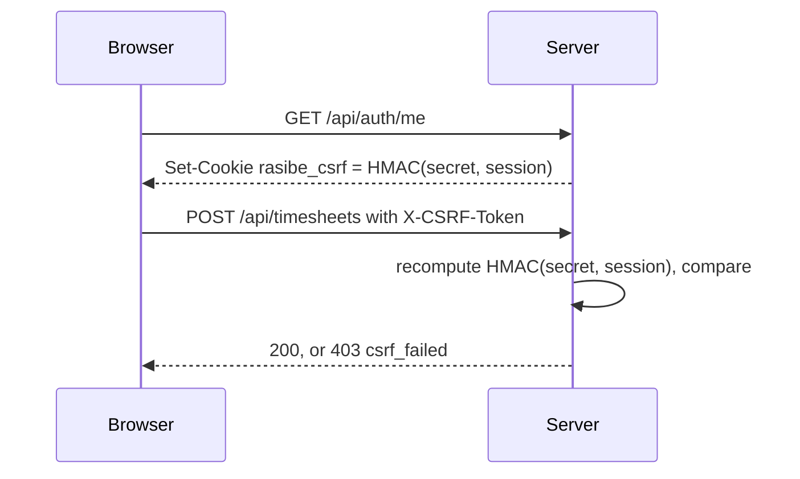

# Cross-site request forgery

How Rasibe CPMS meets NFR-SEC-008, and why the design is the shape it is.

Delivered by RCP-07, together with session rotation (NFR-SEC-010).

## The problem

The session is a cookie, and browsers attach cookies to a request no matter which page caused it. So a page on another site can cause the browser to send an authenticated write to this API: approve a timesheet, issue an invoice, change a rate. The browser is behaving correctly; it simply cannot tell that the user did not mean it.

## What was already true

Three things were working before this ticket, none of them on purpose.

The session cookie is `SameSite=Lax`, so a browser will not attach it to a cross-site POST at all. `cors()` is restricted to a single configured origin. And the client sends `Content-Type: application/json`, which a plain HTML form cannot produce without a preflight that the server would refuse.

Together those stop the textbook attack. The reason that was not good enough is that none of it was deliberate, named, or tested. Any of the three could have been loosened by a later change with nothing to catch it.

## The gap that remained

`SameSite` works on *sites*, not origins, and a site is the registrable domain. Everything under `rasibe.co.za` is the same site as everything else under it. A compromised or hostile subdomain is therefore inside the boundary `SameSite` draws, and can both send cookies and write them on the parent domain.

That last part is what rules out the common implementation of a token.

## The design



The token is `HMAC-SHA256(CSRF_SECRET, session_id)`. It is never stored. The server recomputes it on each request and compares it with the `X-CSRF-Token` header, in constant time.

**The cookie is only how the value reaches the client. It is never read back as the expected value.** This is the part that matters. In the usual double-submit pattern the server checks that the cookie and the header agree, which a subdomain defeats by writing both halves itself. Here, agreement between the two proves nothing, because the server does not consult the cookie. To produce a valid token an attacker needs the secret and the session identifier, and the session cookie is `httpOnly`.

Reads are not challenged. `GET`, `HEAD` and `OPTIONS` change nothing, and they are how the token is handed out. The client calls `/auth/me` when it loads, so a token is always in place before a write is possible.

An `Origin` header that is present and does not match is refused before the token is even considered. A missing `Origin` is not treated as a failure, because same-origin requests and non-browser clients may omit it; the token is the control that does not depend on a header existing.

## The client

One function in `web/src/lib.tsx`, which is the only place the front end makes a request:

```ts
function csrfHeader(): Record<string, string> {
  const match = document.cookie.match(/(?:^|;\s*)rasibe_csrf=([^;]*)/);
  return match ? { 'X-CSRF-Token': decodeURIComponent(match[1]) } : {};
}
```

The session stays a cookie. There is no `Authorization` header and no change to any call site.

## Session rotation (NFR-SEC-010)

Roles are read from the database on every request, so privileges can never be stale. The only privilege change this system has is signing in, and the risk there is fixation: an identifier planted in the browser before sign in would otherwise stay valid next to the new one until it expired.

Signing in now revokes whatever session the request arrived with, then issues a new one. Because the token is derived from the session, it changes at the same moment and the old one stops working.

Signing out replaces the token rather than clearing it. The token has become wrong, since the session behind it is revoked, but the client stays on the page and the next sign in is itself a write that needs a valid one. Clearing the cookie leaves nothing to send and the sign in that follows is refused until the user reloads. This was found in the browser, not in the suite: the test client fetches a token when it has none, which a browser does not do. There is now a check for the sequence.

## What this does not cover

Before sign in there is no session to bind to, so every anonymous visitor shares one token value. Any visitor can obtain it by loading the site. That is enough to require a deliberate, script-issued request, but it does not make sign in itself unforgeable: an attacker could still try to cause a victim's browser to sign in as the attacker. The damage is bounded — work would be recorded against the attacker's own account, which is self-defeating — and closing it properly needs per-browser state before authentication. It is recorded here rather than left implied.

## Settings

| Variable | Effect |
| --- | --- |
| `CSRF_SECRET` | Signs the token. Without it a fresh secret is generated at boot |

Leaving it unset costs one rejected write and a reload after a restart. It must be set wherever more than one instance serves the same users, or the instances will disagree about every token.

## Evidence

The server suite drives real writes and asserts that a write without the token is refused with `csrf_failed`, that a token the attacker chose for both the cookie and the header is refused, that a foreign `Origin` is refused even with a valid token, that reads are unaffected, that signing in issues a new session identifier and a new token, that the identifier held beforehand is revoked rather than merely replaced, and that signing in immediately after signing out is accepted. Those run on every pull request as part of Server CI.
