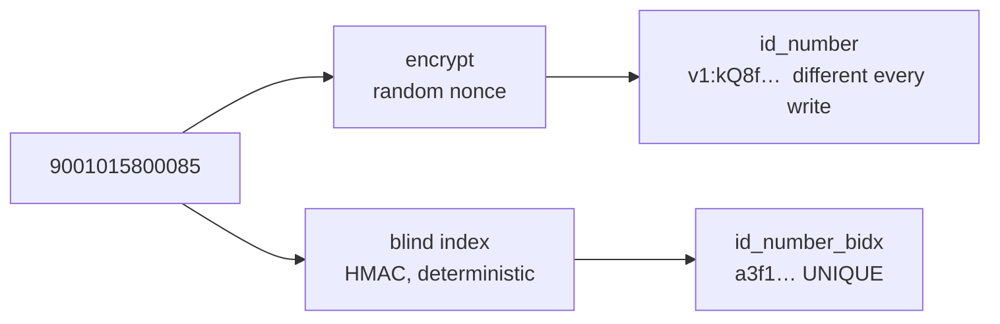

# Encryption at rest

RCP-08. Realises NFR-SEC-005.

## The problem

Row-level security and the projection in `project()` decide who may *read* a
consultant's identity number, banking reference or vetting outcome. Both are
enforced by the running system, and both stop mattering the moment somebody
holds a copy of the data instead of a session: a database dump, a backup file,
a snapshot taken by the hosting provider, a disk that left the building.

Until this ticket those columns were stored as typed. Anyone with the file had
them.

## What is encrypted

| Column | Treatment |
| --- | --- |
| `consultant.id_number` | Ciphertext, plus a blind index for uniqueness |
| `consultant.bank_name` | Ciphertext |
| `consultant.bank_account_ref` | Ciphertext |
| `consultant.vetting_status` | Ciphertext |
| `consultant.vetting_cleared_on` | Left as a date, deliberately |

A clearance date on its own says nothing without the outcome standing next to
it, and keeping it as a `date` keeps it sortable and queryable. That is a
judgement call rather than an oversight, so it is written down here.

## Where the key lives

In the environment of the API process, and nowhere else. PostgreSQL never
receives it.

This is the reason `pgcrypto` was not used, despite already being installed for
password hashing. Encrypting inside the database means handing it the key in a
statement, and statements end up in logs, in `pg_stat_activity`, and in the very
backups the encryption is meant to protect. A key stored beside the data it
protects is decoration.

## The shape of a stored value

```
v1:<base64 of nonce ‖ authentication tag ‖ ciphertext>
```

AES-256-GCM, with a fresh 12-byte nonce for every write. GCM authenticates as
well as encrypts, so a value altered in the database fails to decrypt rather
than returning something plausible.

The `v1:` prefix is what makes a future key rotation possible: new values can be
written under a second version while old ones are still readable, instead of
having to guess which key a value belongs to.

## Uniqueness, and why ciphertext breaks it

`id_number` carried a `UNIQUE` constraint. Encryption uses a random nonce, so
the same identity number encrypts to a different string every time and a unique
index on the column would never fire. Two records for one person would become
possible, silently.

So uniqueness moved to `id_number_bidx`: an HMAC-SHA256 of the value with
spacing and case removed. The same number always gives the same fingerprint, so
the constraint still works, while the fingerprint itself discloses nothing.



The index uses a **separate key** from the encryption. Both sit in the same
database, and sharing one key would let each be used as leverage against the
other.

Nothing in the system looks a consultant up by identity number, so the index
exists only to hold the constraint. It is stripped from every response before
serialisation, for every role, because it has no business meaning.

## Where the plaintext reappears

One place: `project()` in `server/src/lib/errors.ts`, which every response row
already passed through on its way to the role filter. Decrypting there meant no
read path anywhere else had to change — not the routes, not the front end.

The write path could not be as contained. `consultants.ts` names `id_number` in
an `INSERT` column list and in the `PATCH` field map, so both encrypt the value
and set the fingerprint beside it. Banking and vetting are never written through
the API, only read, so they needed nothing.

## Settings

| Variable | Effect |
| --- | --- |
| `DATA_ENCRYPTION_KEY` | 32 bytes, as 64 hex characters or base64. Encrypts the values |
| `DATA_INDEX_KEY` | 32 bytes, same format. Derives the blind index |

Generate each with `openssl rand -hex 32`.

Unset in development and CI, a fixed key is derived so a fresh clone and the
test suite work with no setup. **Unset in production the server refuses to
start.** A missing key there would mean writing the data in clear, which is the
exact failure this ticket exists to prevent, and failing at boot is better than
discovering it in a dump months later.

Losing `DATA_ENCRYPTION_KEY` loses the data it protects. It belongs wherever the
database password already lives, and it must be included in whatever RCP-16
ends up defining as the backup.

## Existing rows

`db/01` through `db/04` build the database, and they cannot encrypt anything,
because the key is not theirs to hold. Seeded rows therefore arrive in clear and
are turned over afterwards:

```
npm run encrypt-existing
```

It is idempotent — values already carrying `v1:` are skipped, so a second run
reports nothing to do. Server CI runs it after seeding, which is the same step
that runs on deploy day against data that already exists.

It bumps `updated_at` on the rows it rewrites. The row genuinely changed, so
that is left as is rather than worked around.

## Evidence

The server suite reads the table directly rather than through the API, because
the claim is about what a stolen copy would contain, and an API that is merely
consistent with itself proves nothing. It asserts that the identity number,
banking reference and vetting outcome are all stored as `v1:` ciphertext, that
the original digits do not appear in the stored value, that **no** restricted
value anywhere in the table survives in clear, that an administrator still reads
the number as text, that the blind index never reaches the client, that a
duplicate is still refused with a message naming the identity number, that the
same number spaced differently still collides, that editing moves the
fingerprint with the value, and that a number edited away becomes reusable.

Those run on every pull request as part of Server CI.

## What this does not cover

Encryption at rest, not in use. While the API is running it holds the key and
can decrypt anything it is allowed to read, so this is no defence against a
compromise of the server itself — that is what row-level security, the role
projection and the audit trail are for.

Nor does it cover the other direction: `document` rows point at vetting and
banking evidence held outside the database, and those files are not in scope
here.
