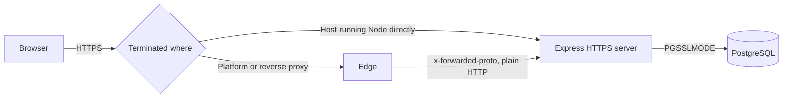

# TLS

How Rasibe CPMS meets NFR-SEC-001, how to run it encrypted locally, and what changes when the system is hosted.

Delivered by RCP-06.

## What the requirement covers

Two hops carry data, and both are in scope. The browser to the API carries session cookies and every rate the role is allowed to see. The API to PostgreSQL carries all of it again, plus the identity and banking columns. Encrypting only the first would leave the second in clear on whatever network separates the application from its database.

## Two ways TLS is terminated

The code supports both, so the hosting decision can be made later without changing it.



**Terminated at the edge.** Render, Railway, Azure App Service, Fly and nginx all do this. The API receives plain HTTP and learns the original protocol from the forwarded headers, so `TRUST_PROXY` must be set or it will believe every request arrived insecurely. Leave `TLS_CERT_FILE` and `TLS_KEY_FILE` unset.

**Terminated by this process.** A plain virtual machine with its own certificate. Set `TLS_CERT_FILE` and `TLS_KEY_FILE` and the API listens with TLS 1.2 as the floor. Leave `TRUST_PROXY` unset, because nothing is in front.

## Settings

| Variable | Effect |
| --- | --- |
| `TLS_CERT_FILE`, `TLS_KEY_FILE` | Both set: serve HTTPS, minimum TLS 1.2. Either unset: serve plain HTTP |
| `FORCE_HTTPS` | `true` redirects plain HTTP to HTTPS with a 308 |
| `PUBLIC_HOST` | The host that redirect points at. Required when `FORCE_HTTPS` is `true`; startup refuses without it |
| `TRUST_PROXY` | Hop count or address list. Only when a proxy is genuinely in front |
| `PGSSLMODE` | `disable` (default), `require`, or `verify-full` for the database connection |
| `PGSSLROOTCERT` | Certificate authority file, for `verify-full` against a private authority |

All of them are off by default, so development and CI run over plain HTTP exactly as before.

## Running HTTPS locally

```powershell
.\scripts\gen-dev-cert.ps1
```

It writes `server/certs/localhost-cert.pem` and `localhost-key.pem`, valid for a year. The folder is excluded by `.gitignore`; nothing it produces may be committed. Then point the API at the pair and start it:

```powershell
$env:TLS_CERT_FILE = "$PWD\server\certs\localhost-cert.pem"
$env:TLS_KEY_FILE  = "$PWD\server\certs\localhost-key.pem"
cd server; npm.cmd run dev
```

The API now answers on `https://localhost:4000`. The certificate signs itself, so a browser warns once and `curl` needs `-k`. That is the only difference from a hosted certificate.

Vite still proxies to `http://localhost:4000` by default. Running the API on HTTPS means changing that target in `web/vite.config.ts`, which is Nosipho's file, so plain HTTP stays the default for day-to-day work and HTTPS is used to verify the control.

## Why the session cookie is always Secure

`secure` no longer follows `NODE_ENV`. A session identifier that travels in clear even once is already exposed, and an environment variable is not evidence about the network a request actually crossed. Browsers treat `localhost` as a trustworthy origin and store Secure cookies from it, so development over plain HTTP is unaffected.

Sign-out passes the same attributes to `clearCookie`. A cookie is removed by matching it, so attributes that drift between setting and clearing can leave a browser holding a session the server has already revoked.

## Why trusting the proxy is opt-in

`req.ip` becomes the forwarded address once `trust proxy` is set, and `login_attempt` records it. If it were always on, any client could send its own `X-Forwarded-For` and choose what gets written there, which would corrupt the sign-in record (FR-AUT-011) and let an attacker step around the per-address throttle that RCP-10 adds. So it is set only where a proxy is known to be in front and is known to overwrite the header.

## Where the redirect points (RCP-19, CWE-601)

The redirect used to be built from the request:

    res.redirect(308, `https://${req.headers.host}${req.originalUrl}`);

`Host` is supplied by whoever is calling. A request carrying `Host: attacker.example` was answered with `Location: https://attacker.example/...`, so the caller chose where the browser went — and because the redirect is a 308, the method and body were carried there too. A link to the real service was enough to land a user somewhere else, which is worth more to an attacker than it sounds: the page they arrive at can be a convincing copy of the sign-in form.

The destination is now configuration. `PUBLIC_HOST` is read once at startup, checked to be a bare host or `host:port`, and used for every redirect regardless of what the request says.

Startup refuses when `FORCE_HTTPS` is `true` and `PUBLIC_HOST` is absent, rather than falling back to the request. A fallback would reintroduce the exact behaviour being removed, and would do it silently on the one deployment where somebody forgot the variable. A server that will not boot is the louder failure, and the louder failure is the right one here.

The same check rejects a value carrying a scheme, a path, a credential or whitespace, so a misconfigured variable cannot quietly point the redirect somewhere else either.

## Evidence

The server suite asserts the HSTS header, that the session cookie carries `Secure` and `HttpOnly`, and that the redirect stays inactive when `FORCE_HTTPS` is unset. Those run on every pull request as part of Server CI.

For the redirect destination it builds a second application with `FORCE_HTTPS` on — the suite itself drives plain HTTP with it off, so the branch is otherwise unreachable — and requests it through `node:http` rather than `fetch`, because `fetch` will not send a chosen `Host` header and forging one is the entire point. It asserts that an unencrypted request is redirected, that the destination is the configured host, that a forged `Host` header changes nothing, that the forged value appears nowhere in the response, that the path and query survive, and that startup refuses both a missing and a malformed `PUBLIC_HOST`.

Five of those eight checks were confirmed to fail against the code as it stood before this ticket, with the forged request answered `https://attacker.example/api/health`. The three that passed did so because a request with an honest `Host` header produced the right answer even when built the wrong way, which is precisely why asserting the happy path alone would not have caught this.

## At deployment

1. Obtain a real certificate. Let's Encrypt if the process terminates TLS, otherwise whatever the platform issues. Only the two file paths change.
2. Set `NODE_ENV=production`, which also hides internal error detail (NFR-SEC-012).
3. Point `CORS_ORIGIN` at the real web origin.
4. Set `TRUST_PROXY` if anything sits in front, and confirm the edge overwrites `X-Forwarded-For` rather than appending to a client-supplied value.
5. Set `FORCE_HTTPS=true`, and `PUBLIC_HOST` to the canonical host. The process will not start with one and not the other.
6. Set `PGSSLMODE`. Managed PostgreSQL needs at least `require`.
7. Arrange renewal. A certificate that silently expires is an outage.
